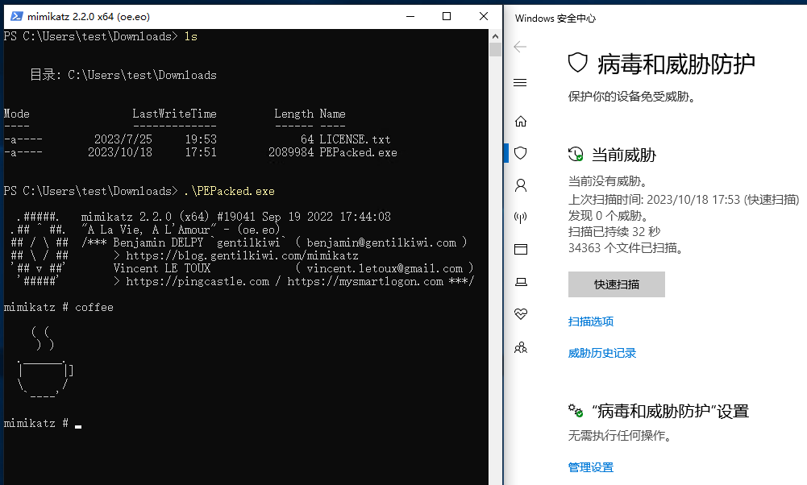

# 介绍

PEPacker是一款PE加壳工具。本工具支持64位及32位（试验性）程序加壳。

# 编译

开发环境为Visual Studio 2019，项目依赖 `crypto++` 库，推荐使用 `vcpkg` 安装：

```
.\vcpkg install cryptopp:x64-windows
.\vcpkg install cryptopp:x64-windows-static
.\vcpkg install cryptopp:x64-windows-static-md
.\vcpkg install cryptopp:x86-windows
.\vcpkg install cryptopp:x86-windows-static
.\vcpkg install cryptopp:x86-windows-static-md
```

安装完依赖后直接编译即可。

# 使用方式

**1. 编译程序：** 

编译完成会获得如下文件：

```
PEPacker.exe       加壳工具
PEStub.exe         存根文件
```

**2. 准备密钥文件：**

PEPacker使用了AES加密算法保护被加壳文件，加壳前需要准备密钥文件。

在同级目录下新建一个 `LICENSE.txt` 文件，其中写入HEX格式的AES密钥，长度支持128/192/256位，为了方便，密钥可以使用MD5或SHA256算法生成，例如：

```
echo|set /p="e10adc3949ba59abbe56e057f20f883e" > LICENSE.txt
```

此时，文件列表如下：

```
PEPacker.exe       加壳工具
PEStub.exe         存根文件
LICENSE.txt        密钥文件
```

**3. 使用以下指令加壳：**

```` 
PEPacker.exe [PEStub.exe] [OtherPE.exe]
````

加壳完毕后会生成 `OtherPE_packed.exe` 文件，即为加壳后的程序。

**4. 执行加壳文件：** 

由于有密码的保护，加壳程序执行时需要确保 `LICENSE.txt` 文件放在同级目录，文件列表如下：

```
OtherPE_packed.exe  加壳后的文件
LICENSE.txt           密钥文件
```

随后便可以直接运行 `OtherPE_packed.exe` 文件，使用方式与原程序一致。

# DEMO

下面是运行效果图



# 感谢

https://github.com/NUL0x4C/AtomPePacker

https://github.com/weidai11/cryptopp

